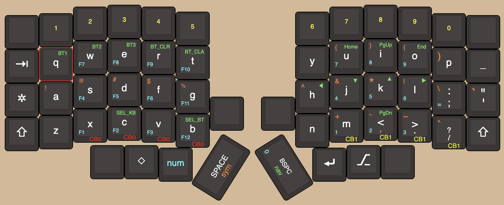

# zmk-config

These are my personal [ZMK firmware](https://github.com/zmkfirmware/zmk/) configurations.

## Lily58 (for Corne)

This configuration is in preparation for my future Corne build.

### Layering
- ***CB0*** denotes the combo to move to the default layer.
- ***CB1*** denotes the combo to move to the backup layer.
- ***num*** moves to the number layer.
- ***sym*** moves to the symbol layer.
- ***nav*** moves to the navigation layer (incl. BlueTooth config).

### Modifications
- Left shift + backspace is delete.   

### Homerow mods

- ***A*** : ◇
- ***S*** : ⎇
- ***D*** : ✲
- ***F*** : ⇧

Flipped for **J**,**K**,**L**,**M**.
